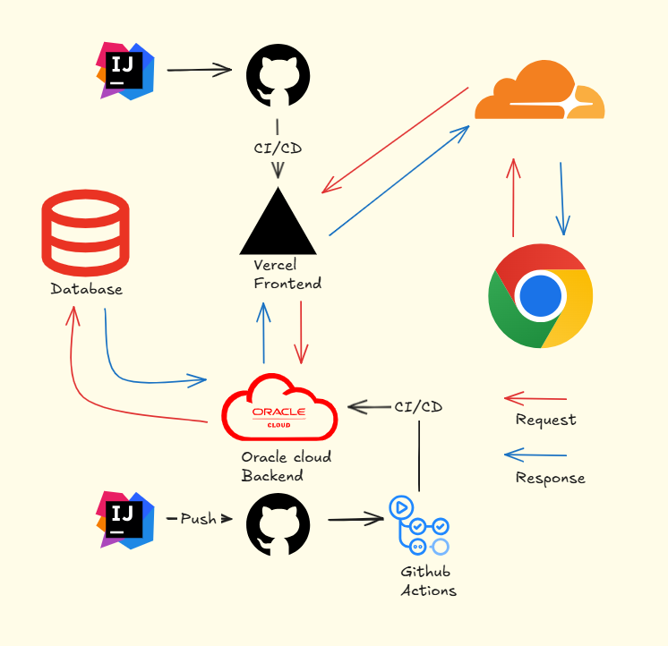

> Next.js, TypeScript, TailwindCSS 등  
> 최신 기술을 활용한 커스터마이징 가능한 블로그 제작 프로젝트  
> 포트폴리오 및 기술 학습을 위한 개인 개발 프로젝트입니다.
---  

## 1. 프로젝트 목적

- Next.js, TypeScript, TailwindCSS 등 평소 접하지 못했던 최신 프레임워크 및 라이브러리 학습
- 기존 블로그 플랫폼의 정형화된 기능 한계를 넘어서기 위해, 어플리케이션을 직접 구현 및 배포하여  
  자유롭게 기능을 커스터마이징할 수 있는 블로그 운영 환경 구축
---  

## 2. 구성원

- **최준혁 (100%)**
- 기획부터 개발, 배포까지 전 과정을 직접 수행

---  

## 3. 작업기간
- **2025-04-19 ~ 2025-05-02**

---  

## 4. 주요 기능

- 게시글 CRUD 기능
- Dev Tools 메뉴를 통한 다양한 개발자 유틸리티 제공
- Next.js의 정적/동적 캐싱 기능을 활용한 빠른 페이지 전환
- ELK Stack을 활용한 고성능 검색 기능
- 클라우드 배포 기반의 24시간 무중단 운영

---  

## 5. 기술 스택

- **Backend**:Java,Spring Boot,JPA,Junit5
- **Database**:Oracle Cloud Database
- **Frontend**: TypeScript, Next.js (App Router)
- **Styling**: TailwindCSS
- **Infrastructure**:Cloudflare,Vercel,Oracle Cloud,GitHub Actions
- **Search**:ELK Stack (Elasticsearch, Logstash, Kibana)

---  

## 6. 개발 과정

- 📘 [Frontend Repository (Next.js)](https://github.com/Haisia/project-blog-next)
- 📕 [Backend Repository (Spring Boot)](https://github.com/Haisia/project-backend-spring)
- 📆 [프로젝트 관리 보드 (GitHub Project)](https://github.com/users/Haisia/projects/10)

---  

## 7. 배포 링크

- 🔗 **Live URL** : [https://haisia.dev](https://haisia.dev)

---  
## 8. 시스템 흐름도

---  
## 9. 프로젝트 회고
약 2주간의 프로젝트가 마무리되었다.  
물론 아직 고도화를 위한 추가 기능들이 남아 있지만,  
처음 기획 단계에서 꼭 필요하다고 생각했던 핵심 기능들은 모두 구현을 마쳤다.

이전에도 여러 사이드 프로젝트를 진행한 경험은 있었지만,  
대부분 백엔드에 집중되어 있었고,  
새로운 기술을 도입한 뒤에는 금세 흥미를 잃고 흐지부지된 경우가 많았다.

이번 프로젝트는 조금 달랐다.  
프론트엔드부터 스타일링까지 화면단 작업을 포함해 전반적인 개발을 직접 맡아 진행했다.  
걱정도 있었지만, 막상 결과물을 눈으로 확인해보니  
예상보다 꽤 그럴듯한 완성도를 갖춘 것 같아 개인적으로 뿌듯하다.

작업 결과가 시각적으로 즉각 반영되다 보니,  
기능을 하나씩 구현할 때마다 점점 더 흥미가 붙었다.  
그 흥미는 곧 몰입으로 이어졌고,  
그 몰입이 다시 개발의 속도를 끌어올리는 선순환을 만들어  
2주라는 짧은 기간 동안 전체적인 마무리를 할 수 있었다.

계획에 없던 도메인도 구매해 Product로 직접 운영하게 되었고,  
그동안 미뤄왔던 개인 블로그까지 함께 생겼으니 일석이조라고 생각한다.

TypeScript와 함께한 Next.js 개발은  
생각보다 훨씬 흥미롭고 유익한 경험이었다.  
특히 Next.js가 제공하는 다양한 최적화 기능들을 적용하는 과정은  
고통스럽기도 했지만, 동시에 가장 즐거웠던 시간이기도 했다(정말로!).
  
---  

## 10. 향후 고도화 계획

- [ ] 관리자 전용 대시보드 개발
- [ ] 통계 분석 기능 추가 (조회수, 유입 경로 등)
- [ ] 마크다운 기반 에디터 도입
- [ ] 구독 / 알림 기능 (메일링)
- [ ] 반응형 스타일 적용 (모바일/태블릿 대응)